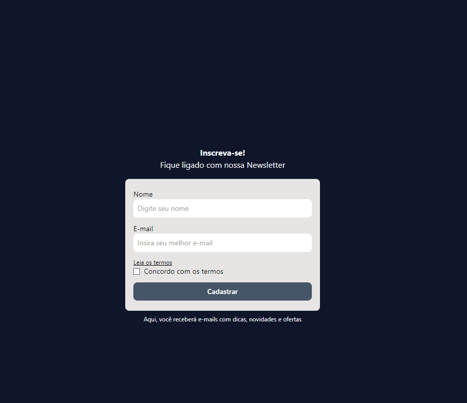

# Form React.ts + Tailwind
 Esse projeto é uma formulário para praticar o uso do React.ts e Tailwind

 ### Demonstração do projeto

 []

## Tecnologias utilizadas

- React
- TypeScript
- Tailwind
- Vite

## Como utilizar

1 - Clone o projeto

```
git clone <url>
```

2 - Acesse a pasta do projeto

```
cd <nome do projeto>
```

2 - Instale as dependências

```
npm install
```

4 - inicie o projeto

```
npm run dev
```

## O que aprendi
- Uso de types
- Estilização com Tailwind
- Configuração inicial para usar Tailwind
- Render condional do React para fazer validação de erros